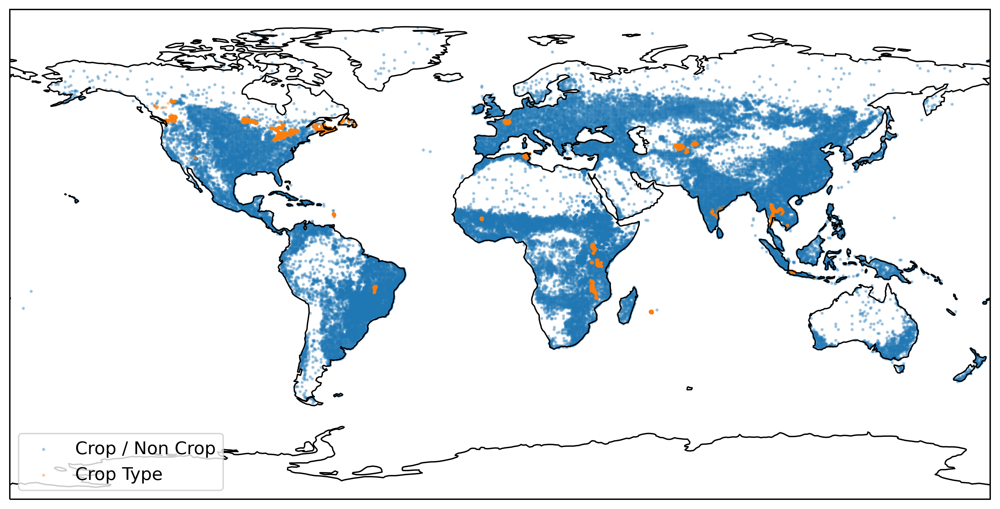

# CropHarvest

CropHarvest is an open source remote sensing dataset for agriculture with benchmarks. It collects data from a variety of agricultural land use datasets and remote sensing products.

### Installation

`cropharvest` can be pip installed by running `pip install cropharvest`

### Getting started
See the [`demo.ipynb`](demo.ipynb) notebook for an example on how to download the data from [Zenodo](https://zenodo.org/record/5533193) and train a random forest against this data.

For more examples of models trained against this dataset, see the [benchmarks](benchmarks).

### Contributing
If you would like to contribute a dataset, please see the [contributing readme](contributing.md).

### License
CropHarvest has a [Creative Commons Attribution-ShareAlike 4.0 International](LICENSE.txt) license.
