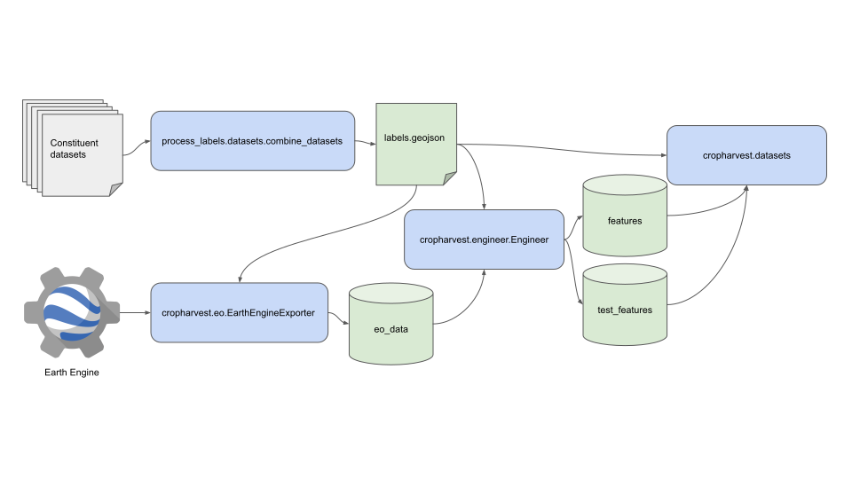

# CropHarvest

CropHarvest is an open source remote sensing dataset for agriculture with benchmarks. It collects data from a variety of agricultural land use datasets and remote sensing products.


The dataset consists of **95,186** datapoints, of which **33,205** (35%) have multiclass labels. All other datapoints only have binary crop / non-crop labels.

**70,213** (74%) of these labels are paired with remote sensing and climatology data, specifically [Sentinel-2](https://sentinel.esa.int/web/sentinel/missions/sentinel-2), [Sentinel-1](https://sentinel.esa.int/web/sentinel/missions/sentinel-1/), the [SRTM Digital Elevation Model](https://cgiarcsi.community/data/srtm-90m-digital-elevation-database-v4-1/) and [ERA 5 climatology data](https://www.ecmwf.int/en/forecasts/datasets/reanalysis-datasets/era5).

21 datasets are aggregated into CropHarvest - these are documented [here](https://github.com/nasaharvest/cropharvest/blob/main/datasets.md).

More details about CropHarvest and the benchmarks are available in [this paper](https://openreview.net/forum?id=JtjzUXPEaCu).

### Pipeline
The code in this repository

1) combines the constituent datasets into a single geoJSON file,
2) exports the associated satellite data from Earth Engine,
3) combines both datasets to create `(X,y)` training tuples and
4) exposes those tuples via a `Dataset` object.

The pipeline through which this happens is shown below:



All blue boxes are associated with code in this repository. Anything green is data accessible via [Zenodo](https://zenodo.org/record/5828893). By default, the Zenodo data will get downloaded to the [data folder](https://github.com/nasaharvest/cropharvest/tree/main/data) - the data folder's [Readme](https://github.com/nasaharvest/cropharvest/blob/main/data/README.md) has more information about the exact structure of the data.

There are unique cases where you may need to use the `EarthEngineExporter` directly, these use cases are demonstrated in the [`demo_exporting_data.ipynb`](https://github.com/nasaharvest/cropharvest/blob/main/demo_exporting_data.ipynb) notebook.

### Installation
Linux and MacOS users can install the latest version of CropHarvest with the following command:
```bash
pip install cropharvest
```
Windows users must install the CropHarvest within a [conda](https://docs.conda.io/en/latest/miniconda.html) environment to ensure all dependencies are installed correctly:
```bash
conda install 'fiona>=1.5' 'rasterio>=1.2.6'
pip install cropharvest
```

### Getting started [](https://colab.research.google.com/github/nasaharvest/cropharvest/blob/main/demo.ipynb)
See the [`demo.ipynb`](https://github.com/nasaharvest/cropharvest/blob/main/demo.ipynb) notebook for an example on how to download the data from [Zenodo](https://zenodo.org/record/7257688) and train a random forest against this data.

For more examples of models trained against this dataset, see the [benchmarks](https://github.com/nasaharvest/cropharvest/blob/main/benchmarks).

### Contributing
If you would like to contribute a dataset, please see the [contributing readme](https://github.com/nasaharvest/cropharvest/blob/main/contributing.md).

### ~~FAQ~~ Questions asked at least once

<details>
<summary><a href=https://github.com/nasaharvest/cropharvest/issues/95>How do I use CropHarvest for a specific geography?</a></summary>

All the data is accessible through the `cropharvest.datasets.CropHarvest` object. The main parameters which you might be interested in manipulating are controllable through a `cropharvest.datasets.Task`, which takes as input the following parameters:
- A bounding box, which defines the spatial boundaries of the labels retrieves
- A target label, which defines the class of the positive labels (if this is left to `None`, then the positive class will be crops and the negative class will be non-crops)
- A boolean defining whether or not to balance the crops and non-crops in the negative class
- A test_identifier string, which tells the dataset whether or not to retrieve a file from the `test_features` folder and return it as the test data.

So if I wanted to use this to train a model to identify crop vs. non crop in France, I might do it like this:

```python
from sklearn.ensemble import RandomForestClassifier

from cropharvest.datasets import Task, CropHarvest
from cropharvest.countries import get_country_bbox

# folder into which the data will be downloaded / already exists
data_dir = "data"

# get_country_bbox returns a list of bounding boxes.
# the one representing Metropolitan France is the 2nd box
metropolitan_france_bbox = get_country_bbox("France")[1]

task = Task(bounding_box=metropolitan_france_bbox, normalize=True)

my_dataset = CropHarvest(data_dir, task)

X, y = my_dataset.as_array(flatten_x=True)
model = RandomForestClassifier(random_state=0)
model.fit(X, y)
```
</details>

<details>
<summary><a href=https://github.com/nasaharvest/cropharvest/issues/106>How do I load a specific pixel timeseries?</a></summary>

The <a href=https://github.com/nasaharvest/cropharvest/issues/106>specific use case</a> here is to retrieve NDVI values for a specific row in the `labels.geojson`. Here is how you might go about doing that:

Firstly, I will load the geosjon. I'll do it through a `CropHarvestLabels` object, which is just a wrapper around the geojson but provides some nice utility functions.
```python
>>> from cropharvest.datasets import CropHarvestLabels
>>>
>>> labels = CropHarvestLabels("cropharvest/data")
>>> labels_geojson = labels.as_geojson()
>>> labels_geojson.head()
  harvest_date planting_date  ... is_test                                           geometry
0         None          None  ...   False  POLYGON ((37.08252 10.71274, 37.08348 10.71291...
1         None          None  ...   False  POLYGON ((37.08721 10.72398, 37.08714 10.72429...
2         None          None  ...   False  POLYGON ((37.08498 10.71371, 37.08481 10.71393...
3         None          None  ...   False  POLYGON ((37.09021 10.71320, 37.09014 10.71341...
4         None          None  ...   False  POLYGON ((37.08307 10.72160, 37.08281 10.72197...

[5 rows x 13 columns]
```

Now, I can use the `labels` object to retrieve the filepath of the processed satellite data for each row in the labels geojson:
```python
>>> path_to_file = labels._path_from_row(labels_geojson.iloc[0])
```
This processed satellite data is stored as `h5py` files, so I can load it up as follows:
```python
>>> import h5py
>>> h5py_file = h5py.File(path_to_file, "r")
>>> x = h5py_file.get("array")[:]
>>> x.shape
(12, 18)
```
The shape of `x` represents 12 timesteps and 18 bands. To retrieve the band I am interested in:
```python
>>> from cropharvest.bands import BANDS
>>> x[:, BANDS.index("NDVI")]
array([0.28992072, 0.28838343, 0.26833579, 0.22577633, 0.27138986,
       0.06584114, 0.498998  , 0.50147203, 0.50437743, 0.44326343,
       0.33735849, 0.28375967])
```
These are 12 NDVI values, corresponding to the 12 months captured in this timeseries. To find out exactly which month each timestep represents, I can do
```python
>>> labels_geojson.iloc[0].export_end_date
'2021-02-01T00:00:00'
```
Wich tells me that the last timestep represents January 2021. I can work backwards from there.

</details>

<details>
<summary><a href="https://github.com/nasaharvest/cropharvest/issues/88">What is the data format?</a></summary>
The structure of the different data files is now described in depth in the data folder's [Readme](https://github.com/nasaharvest/cropharvest/blob/main/data/README.md)
</details>

### License
CropHarvest has a [Creative Commons Attribution-ShareAlike 4.0 International](https://github.com/nasaharvest/cropharvest/blob/main/LICENSE.txt) license.

### Citation

If you use CropHarvest in your research, please use the following citation:
```
@inproceedings{
    tseng2021cropharvest,
    title={CropHarvest: A global dataset for crop-type classification},
    author={Gabriel Tseng and Ivan Zvonkov and Catherine Lilian Nakalembe and Hannah Kerner},
    booktitle={Thirty-fifth Conference on Neural Information Processing Systems Datasets and Benchmarks Track (Round 2)},
    year={2021},
    url={https://openreview.net/forum?id=JtjzUXPEaCu}
}
```
